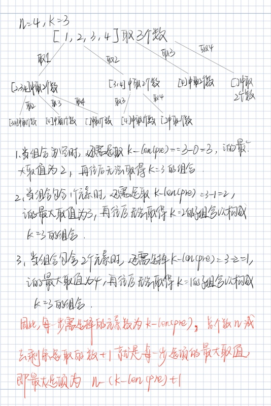
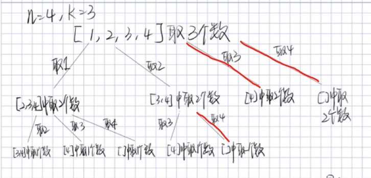
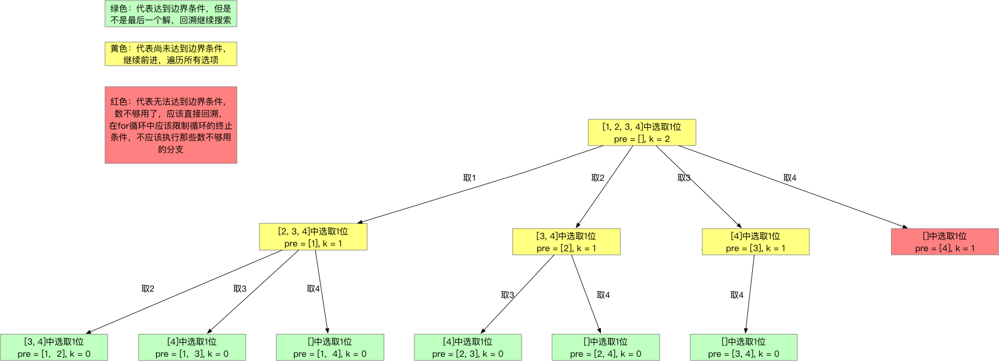

<h1>Leetcode回溯系列（一）--- 组合</h1>


题目：<https://leetcode-cn.com/problems/combinations>

<h2>1. 题目知识点</h2>

1. 回溯算法：
    1. **思想**：回溯算法可看作枚举法/暴力破解的升级版。是一种`选优搜索`法，按`选优条件`向前搜索，以达到最终`目标`。但当探索到某一步时，发现原先选择并`不优`或`达不到目标`，则`回溯`；
    2. **场景**：回溯算法从解决问题的每一步的所有可能选项里选择出可行解决方法，适合`由多个步骤组成的问题，并且每一个步骤都有多个选项`。当我们在某一步选择了其中一个选项，就进入下一步，然后又面临新的选项。
    3. **画图理解**：分析回溯问题，需要画图理清思路和寻找边界条件。用回溯法解决的问题可以使用树状结构来表示，某一个步骤有n个可能的选项，那么每一个步骤可以看作是树的一个节点，每一个选项可视作树的边，后续步骤是前序步骤的字节点。
    4. **实现**：回溯算法适合用**递归**实现。**当算法到达某一个节点时，尝试使用所有可能的选项，并在满足条件的前提下递归的前往下一个节点**。

<h2>2. 题目分析</h2>

1. n个数本质为有序、无重复、正整数的数组
2. 找出所有组合暗含解集不包含重复组合

<h2>3. 题目解法</h2>


<h3>3.1. 库方法</h3>

**核心思想**：Python的itertools库提供了combinations方法来实现组合

```
import itertools


class Solution:
    def combine(self, n: int, k: int) -> List[List[int]]:
        return list(itertools.combinations(range(1, n+1), k))
```

<h3>3.2. 回溯法</h3>

**核心思想**是分析回溯问题，必须画图！！！理清思路和边界条件。按顺序取就无需使用used数组来判断是否取过，能够取的所有组合。

**为什么按顺序取就能遍历数组的全组合呢？**

1. 从递归纵向深度来思考，`i+1`/按顺序取，能够保证每次（每往深层递归）选取的元素与之前（所有浅层递归）选取的元素不存在重复，即每次（每个节点）选取出来的都是合法的组合（元素不重复），且组合不重复
2. 从递归横向遍历来思考，`i+1`/按顺序取，能够保证每往右遍历得到的组合与之前的组合不重复

+ 为什么用切片操作？

    > 前者对curr进行了slicing的操作，会生成curr的拷贝再加入到output里，后者则是直接把curr本身加入了output里。如果用后面这种写法，每次往output里添加的curr都是同一个list，每次对curr进行操作，都会体现在output里所有的curr中，也就是output里的所有list会同步发生变化。
    
**复杂度分析**

+ 时间复杂度： $O(k * C^k_N)$，其中$C^k_N = \frac{N!}{(N-k)!k!}$是要构成的组合数
    + `append` / `pop` (`add`/ `removeLast`) 操作使用常数时间，唯一耗费时间的是将长度为 `k` 的组合添加到输出中。
+ 空间复杂度：$O(C^k_N)$
    + 用于保存全部组合数以输出。

    
```
class Solution:
    def combine(self, n: int, k: int) -> List[List[int]]:
        # handle illegal input
        if n <= 0 or k <= 0 or k > n:
            return []
        res = []
        self.__backtrack(1, k, n, [], res)
        return res

    def __backtrack(self, start: int, k: int, n: int, pre: List, res: List[List[int]]) -> None:
        if len(pre) == k:
            res.append(pre[:])
            return
        
        end = n 
        for i in range(start, end+1):
            pre.append(i)
            self.__backtrack(i+1, k, n, pre, res)
            pre.pop()
```

<h3>3.3. 回溯法+剪枝</h3>

**核心思想**是分析回溯问题，必须画图！！！理清思路和边界条件。画图分析剪枝条件



超出选项均剪枝，下图红色即剪枝






**复杂度分析**

+ 时间复杂度： $O(k * C^k_N)$，其中$C^k_N = \frac{N!}{(N-k)!k!}$是要构成的组合数
    + `append` / `pop` (`add`/ `removeLast`) 操作使用常数时间，唯一耗费时间的是将长度为 `k` 的组合添加到输出中。
+ 空间复杂度：$O(C^k_N)$
    + 用于保存全部组合数以输出。

```
class Solution:
    def combine(self, n: int, k: int) -> List[List[int]]:
        # handle illegal input
        if n <= 0 or k <= 0 or k > n:
            return []
        res = []
        self.__backtrack(1, k, n, [], res)
        return res

    def __backtrack(self, start: int, k: int, n: int, pre: List, res: List[List[int]]) -> None:
        if len(pre) == k:
            res.append(pre[:])
            return
        
        end = n - (k - len(pre)) + 1
        for i in range(start, end+1):
            pre.append(i)
            self.__backtrack(i+1, k, n, pre, res)
            pre.pop()
```
