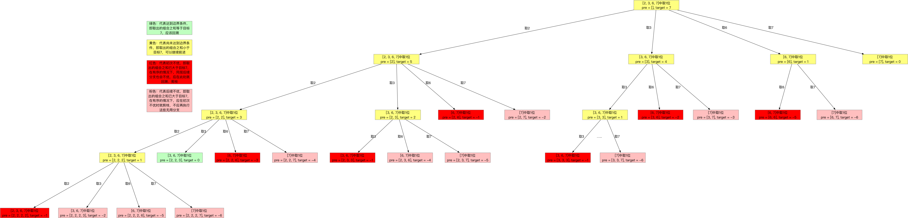

<h1>Leetcode回溯系列（二）--- 组合之和</h1>

题目：<https://leetcode-cn.com/problems/combination-sum/>

<h2>1. 题目知识点</h2>

1. 回溯算法：
    1. **思想**：回溯算法可看作枚举法/暴力破解的升级版。是一种`选优搜索`法，按`选优条件`向前搜索，以达到最终`目标`。但当探索到某一步时，发现原先选择并`不优`或`达不到目标`，则`回溯`；
    2. **场景**：回溯算法从解决问题的每一步的所有可能选项里选择出可行解决方法，适合`由多个步骤组成的问题，并且每一个步骤都有多个选项`。当我们在某一步选择了其中一个选项，就进入下一步，然后又面临新的选项。
    3. **画图理解**：分析回溯问题，需要画图理清思路和寻找边界条件。用回溯法解决的问题可以使用树状结构来表示，某一个步骤有n个可能的选项，那么每一个步骤可以看作是树的一个节点，每一个选项可视作树的边，后续步骤是前序步骤的字节点。
    4. **实现**：回溯算法适合用**递归**实现。**当算法到达某一个节点时，尝试使用所有可能的选项，并在满足条件的前提下递归的前往下一个节点**。


<h2>2. 题目分析</h2>

1. 无序、无重复、正整数数组
2. 数组中的数字可以无限制重复被选取
3. 解集不能包含重复的组合

<h2>3. 题目解法</h2>

<h3>3.1. 回溯法</h3>

**核心思想**是分析回溯问题，必须画图！！！理清思路和边界条件。

+ 虽然按顺序取可以避免重复组合，但是这道题又不是单纯的组合问题，题目使用允许重复元素，所以，在搜索的时候，搜索起点的下标`begin`设置为当前首节点，由于一个数可以使用多次，下一层的结点同样从`这个搜索起点begin/当前首节点`开始搜索；**深层递归时，搜索起点保持不变，以允许取得重复元素**
+ 在搜索起点，`包含begin之前的数的组合`在以前的分支搜索过了，如果不以当前首节点为搜索起点，一定会产生重复。


+ 为什么用切片操作？

    > 前者对curr进行了slicing的操作，会生成curr的拷贝再加入到output里，后者则是直接把curr本身加入了output里。如果用后面这种写法，每次往output里添加的curr都是同一个list，每次对curr进行操作，都会体现在output里所有的curr中，也就是output里的所有list会同步发生变化。


求和方法，但是求和方法不如动态减小target方法好，因为对长列表的求和还是比较耗时的
    
```
class Solution:
    def combinationSum(self, candidates: List[int], target: int) -> List[List[int]]:
        if len(candidates) == 0:
            return []
        def backtrack(start: int, candidates: List[int], target: int, pre: List[int], res: List[List[int]]) -> None:
            if sum(pre) == target: 
                res.append(pre[:])
                return
            
            for ele in candidates[start:]:
                pre.append(ele)
                backtrack(candidates.index(ele), candidates, target, pre, res)
                pre.pop()
        
        res = []
        candidates.sort()
        backtrack(0, candidates, target, [], res)
        return res
            
```

动态减小target方法：

```
class Solution:
    def combinationSum(self, candidates: List[int], target: int) -> List[List[int]]:
        if len(candidates) == 0:
            return []
        

        def backtrack(start: int, target: int, size: int, candidates: List[int], pre: List[int], res: List[List[int]]) -> None:
            if target == 0:
                res.append(pre[:])
                return
            
            for index in range(start, size):                
                pre.append(candidates[index])
                backtrack(index, residue, size, candidates, pre, res)
                pre.pop()
        
        res = []
        size = len(candidates)
        candidates.sort()
        backtrack(0, target, size, candidates, [], res)
        return res
```


<h3>3.2. 回溯法+剪枝</h3>

**核心思想**与回溯法相同，引入剪枝提速
1. 如果一个数位搜索起点都不能搜索到结果，那么比它还大的数肯定搜索不到结果，基于这个想法，我们可以对输入数组进行排序，以减少搜索的分支；**排序后，当深层递归的第一个分支target<0，则后续分支也一定小于0，需剪枝取重**

2. 排序是为了提高搜索速度，非必要；

3. 搜索问题一般复杂度较高，能剪枝就尽量需要剪枝。把候选数组排个序，遇到一个较大的数，如果以这个数为起点都搜索不到结果，后面的数就更搜索不到结果了。

参考题解：<https://leetcode-cn.com/problems/combination-sum/solution/hui-su-suan-fa-jian-zhi-python-dai-ma-java-dai-m-2/>





求和方法，但是求和方法不如动态减小target方法好，因为对长列表的求和还是比较耗时的

```
class Solution:
    def combinationSum(self, candidates: List[int], target: int) -> List[List[int]]:
        if len(candidates) == 0:
            return []
        def backtrack(start: int, candidates: List[int], target: int, pre: List[int], res: List[List[int]]) -> None:
            if sum(pre) == target: 
                res.append(pre[:])
                return
            
            for ele in candidates[start:]:
                if sum(pre, ele) > target:
                    break
                
                pre.append(ele)
                backtrack(candidates.index(ele), candidates, target, pre, res)
                pre.pop()
        
        res = []
        candidates.sort()
        backtrack(0, candidates, target, [], res)
        return res
            
```

动态减小target方法：

```
class Solution:
    def combinationSum(self, candidates: List[int], target: int) -> List[List[int]]:
        if len(candidates) == 0:
            return []
        

        def backtrack(start: int, target: int, size: int, candidates: List[int], pre: List[int], res: List[List[int]]) -> None:
            if target == 0:
                res.append(pre[:])
                return
            
            for index in range(start, size):
                residue = target - candidates[index]
                if residue < 0:
                    break
                
                pre.append(candidates[index])
                backtrack(index, residue, size, candidates, pre, res)
                pre.pop()
        
        res = []
        size = len(candidates)
        candidates.sort()
        backtrack(0, target, size, candidates, [], res)
        return res
```

