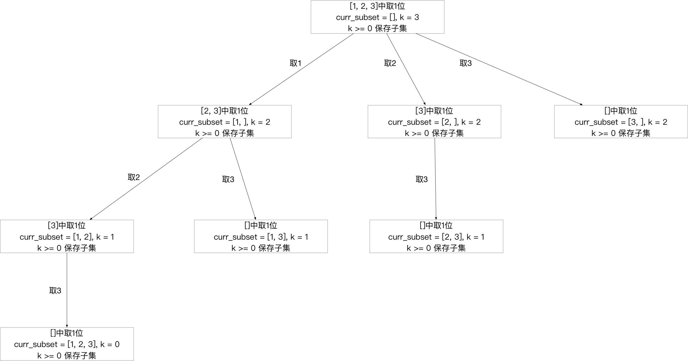

<h1>Leetcode回溯系列（六）--- 子集</h1>

题目：<https://leetcode-cn.com/problems/subsets/>

<h2>1. 题目知识点</h2>

1. 回溯算法：
    1. **思想**：回溯算法可看作枚举法/暴力破解的升级版。是一种`选优搜索`法，按`选优条件`向前搜索，以达到最终`目标`。但当探索到某一步时，发现原先选择并`不优`或`达不到目标`，则`回溯`；
    2. **场景**：回溯算法从解决问题的每一步的所有可能选项里选择出可行解决方法，适合`由多个步骤组成的问题，并且每一个步骤都有多个选项`。当我们在某一步选择了其中一个选项，就进入下一步，然后又面临新的选项。
    3. **画图理解**：分析回溯问题，需要画图理清思路和寻找边界条件。用回溯法解决的问题可以使用树状结构来表示，某一个步骤有n个可能的选项，那么每一个步骤可以看作是树的一个节点，每一个选项可视作树的边，后续步骤是前序步骤的字节点。
    4. **实现**：回溯算法适合用**递归**实现。**当算法到达某一个节点时，尝试使用所有可能的选项，并在满足条件的前提下递归的前往下一个节点**。


<h2>2. 题目分析</h2>

1. n个数本质为无序、无重复、整数的数组
2. 子集的特点：
    1. 元素不重复
    2. 元素不考虑顺序
3. 解集不包含重复子集
4. 由子集特点分析，子集和组合的概念等价，求所有无重复的子集，即等价求数组的所有组合问题，不同于leetcode 77题--只求特定k个数的组合，这道题求的是全组合

<h2>3. 题目解法</h2>

**核心思想**是分析回溯问题，必须画图！！！理清思路和边界条件。

1. 按顺序能遍历数组的全组合，即所有子集
2. 与leetcode77题不同，不同于求k个数的组合/子集--只有等于k时才是边界条件，由于求的是全组合，所以小于等于n的组合/子集都满足条件，均加入解集，当等于n应回溯； 

**画图理解**



```
class Solution:
    def subsets(self, nums: List[int]) -> List[List[int]]:
        if len(nums) == 0: return []
        res = []
        size = len(nums)
        self.backtrack(0, size, size, [], nums, res)
        return res

    
    def backtrack(self, start: int, k: int, size: int, curr_subset: List[int], nums: List[int], res: List[List[int]]) -> None:
        if k >= 0:
            res.append(curr_subset[:])
            if k == 0:
                return
        
        for index in range(start, size):
            curr_subset.append(nums[index])
            self.backtrack(index+1, k-1, size, curr_subset, nums, res)
            curr_subset.pop()
```

