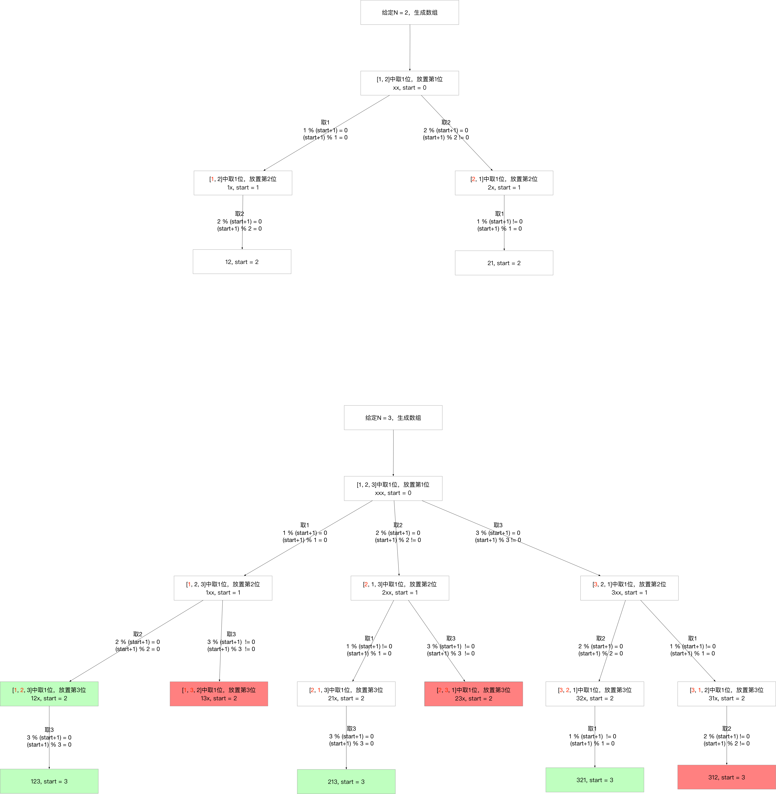

<h1>Leetcode回溯系列（八）--- 优美的排列</h1>

题目：<https://leetcode-cn.com/problems/beautiful-arrangement/>

<h2>1. 题目知识点</h2>

1. 回溯算法：
    1. **思想**：回溯算法可看作枚举法/暴力破解的升级版。是一种`选优搜索`法，按`选优条件`向前搜索，以达到最终`目标`。但当探索到某一步时，发现原先选择并`不优`或`达不到目标`，则`回溯`；
    2. **场景**：回溯算法从解决问题的每一步的所有可能选项里选择出可行解决方法，适合`由多个步骤组成的问题，并且每一个步骤都有多个选项`。当我们在某一步选择了其中一个选项，就进入下一步，然后又面临新的选项。
    3. **画图理解**：分析回溯问题，需要画图理清思路和寻找边界条件。用回溯法解决的问题可以使用树状结构来表示，某一个步骤有n个可能的选项，那么每一个步骤可以看作是树的一个节点，每一个选项可视作树的边，后续步骤是前序步骤的字节点。
    4. **实现**：回溯算法适合用**递归**实现。**当算法到达某一个节点时，尝试使用所有可能的选项，并在满足条件的前提下递归的前往下一个节点**。

<h2>2. 题目分析</h2>


1. n个数本质为无序、无重复、整数的数组
2. **满足特定条件**的全排列
3. 解集不包含重复排列


<h2>3. 题目解法</h2>

<h3>3.1 回溯法+剪枝</h3>

**核心思想**是分析回溯问题，必须画图！！！理清思路和边界条件。

1. **如何取得全排列呢**：
    1. 考虑选取排列的过程，本质是一个多步骤问题：构建一个排列，需要先选取排列第1位，有n种选择；接着，选取排列第2位，有n-1种选择；...，选取排列第i位，有n-i种选择；
    2. 算法核心就是固定前缀算法，根据排列各元素选取的过程，不断固定前缀，向前递归，当不满足时则回溯；
    3. 固定前缀k-1位元素，选取排列的第k位元素，通过遍历后续k, k+1, k+2, ...位元素，并与第k位交换，来选取第k位元素，并递归下去
    4. 与排列不同，组合只有选与不选，不考虑顺序，所以按顺序取就可以遍历所有组合；
2. **如何剪枝/排除不满足优美条件**每一个步骤/（每一位k元素的选取）都要检查是否满足条件：
    1. 第 i 位的数字能被 i 整除 或者
    2. i 能被第 i 位上的数字整除
    3. 否则，剪枝回溯


**画图分析**



```
class Solution:
    def __init__(self):
        self.count = 0

    def countArrangement(self, N: int) -> int:
        if N <= 0: return 0
        nums = [i+1 for i in range(N)]
        res = []
        # self.backtrack(0, N, nums, res)
        # self.backtrack2(0, N, nums)
        self.backtrack3(0, N, nums, res)
        return len(res)

    
    def backtrack(self, start: int, size: int, nums: List[int], res: List[int]) -> None:
        if start == size - 1:
            if nums[start] % size == 0 or size % nums[start] == 0:
                res.append(nums[:])
            return
        
        for index in range(start, size):
            next_start = start + 1
            if nums[index] % next_start != 0 and next_start % nums[index] != 0:
                continue
            nums[start], nums[index] = nums[index], nums[start]
            self.backtrack(next_start, size, nums, res)
            nums[index], nums[start] = nums[start], nums[index]
    
    def backtrack2(self, start: int, size: int, nums: List[int]) -> None:
        if start == size - 1:
            if nums[start] % size == 0 or size % nums[start] == 0:
                self.count += 1
            return
        
        for index in range(start, size):
            next_start = start + 1
            if nums[index] % next_start != 0 and next_start % nums[index] != 0:
                continue
            nums[start], nums[index] = nums[index], nums[start]
            self.backtrack2(next_start, size, nums)
            nums[index], nums[start] = nums[start], nums[index]
    
    def backtrack3(self, start: int, size: int, nums: List[int], res: List[int]) -> None:
        if start == size:
            res.append(nums[:])
            return
        
        for index in range(start, size):
            next_start = start + 1
            if nums[index] % next_start != 0 and next_start % nums[index] != 0:
                continue
            nums[start], nums[index] = nums[index], nums[start]
            self.backtrack3(next_start, size, nums, res)
            nums[index], nums[start] = nums[start], nums[index]
```