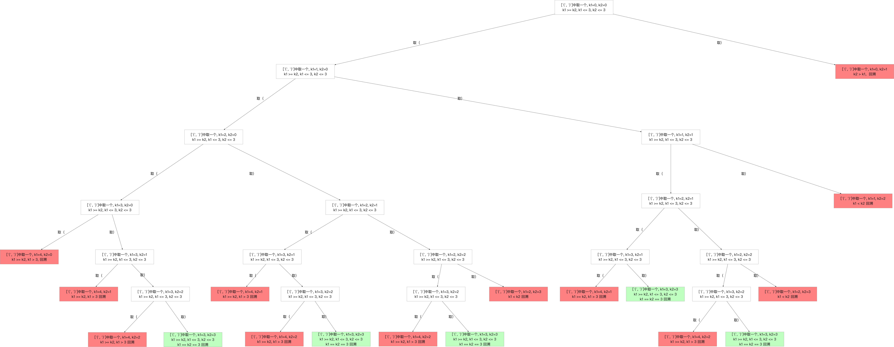

<h1>Leetcode回溯系列（十）--- 括号生成</h1>


题目：<https://leetcode-cn.com/problems/generate-parentheses/>

<h2>1. 题目知识点</h2>

1. 回溯算法：
    1. **思想**：回溯算法可看作枚举法/暴力破解的升级版。是一种`选优搜索`法，按`选优条件`向前搜索，以达到最终`目标`。但当探索到某一步时，发现原先选择并`不优`或`达不到目标`，则`回溯`；
    2. **场景**：回溯算法从解决问题的每一步的所有可能选项里选择出可行解决方法，适合`由多个步骤组成的问题，并且每一个步骤都有多个选项`。当我们在某一步选择了其中一个选项，就进入下一步，然后又面临新的选项。
    3. **画图理解**：分析回溯问题，需要画图理清思路和寻找边界条件。用回溯法解决的问题可以使用树状结构来表示，某一个步骤有n个可能的选项，那么每一个步骤可以看作是树的一个节点，每一个选项可视作树的边，后续步骤是前序步骤的字节点。
    4. **实现**：回溯算法适合用**递归**实现。**当算法到达某一个节点时，尝试使用所有可能的选项，并在满足条件的前提下递归的前往下一个节点**。

<h2>3. 题目解法</h2>

<h3>3.1 回溯法+剪枝</h3>

**核心思想**是分析回溯问题，必须画图！！！理清思路和边界条件。

1. 当前左右括号都有大于 0 个可以使用的时候，才产生分支；（剪枝条件）
2. 产生左分支的时候，只看当前是否还有左括号可以使用；（剪枝条件）
3. 产生右分支的时候，还受到左分支的限制，右边剩余可以使用的括号数量一定得在严格大于左边剩余的数量的时候，才可以产生分支；(剪枝条件)
4. 在左边和右边剩余的括号数都等于 00 的时候结算。（边界条件）
5. **合理使用字符串可以简化代码，不要老想着用列表**

**画图分析**



```
from typing import List


class Solution:
    def generateParenthesis(self, n: int) -> List[str]:

        res = []
        cur_str = ''

        def dfs(cur_str, left, right):
            """
            :param cur_str: 从根结点到叶子结点的路径字符串
            :param left: 左括号还可以使用的个数
            :param right: 右括号还可以使用的个数
            :return:
            """
            if left == 0 and right == 0:
                res.append(cur_str)
                return
            if right < left:
                return
            if left > 0:
                dfs(cur_str + '(', left - 1, right)
            if right > 0:
                dfs(cur_str + ')', left, right - 1)

        dfs(cur_str, n, n)
        return res

作者：liweiwei1419
链接：https://leetcode-cn.com/problems/generate-parentheses/solution/hui-su-suan-fa-by-liweiwei1419/
来源：力扣（LeetCode）
著作权归作者所有。商业转载请联系作者获得授权，非商业转载请注明出处。
```


```
from collections import Counter

class Solution:

    def generateParenthesis(self, n: int) -> List[str]:
        if n <= 0: return []

        parenthesis = ["(", ")"]
        counter = Counter()
        res = []
        # self.backtrack(n, counter, parenthesis, [], res)
        self.backtrack(n, parenthesis, [], res)
        return res


    def backtrack(self,
                  n: int,
                  parenthesis: List[str],
                  pre: List, res: List[str]) -> None:
        if pre.count("(") == pre.count(")") == n:
            res.append("".join(pre))
            return

        for p in parenthesis:
            pre.append(p)
            if pre.count("(") >= pre.count(")") and pre.count("(") <= n and pre.count(")") <= n:
                self.backtrack(n, parenthesis, pre, res)
            pre.pop()
    
    def backtrack2(self,
                n: int,
                counter: Counter,
                parenthesis: List[str],
                pre: List[str], res: List[str]) -> None:
        if counter["("] == counter[")"] == n:
            res.append("".join(pre))
            return

        for p in parenthesis:
            pre.append(p); counter[p] += 1
            if counter["("] >= counter[")"] and counter["("] <= n and counter[")"] <= n:
                self.backtrack2(n, counter, parenthesis, pre, res)
            pre.pop(); counter[p] -= 1
```

```
from collections import Counter

class Solution:

    def generateParenthesis(self, n: int) -> List[str]:
        if n <= 0: return []
        res = []
        self.backtrack('', n, 0, 0, res)
        return res
        
    
    def backtrack(self, curr_str: int, n: int, left: int, right: int, res: List[str]) -> None:
        if left == right == n:
            res.append(curr_str)
            return
        
        if right > left:
            return
        
        if left < n:  # 左分支
            self.backtrack(curr_str+'(', n, left+1, right, res)
        if right < n:  # 右分支
            self.backtrack(curr_str+')', n, left, right+1, res)

```