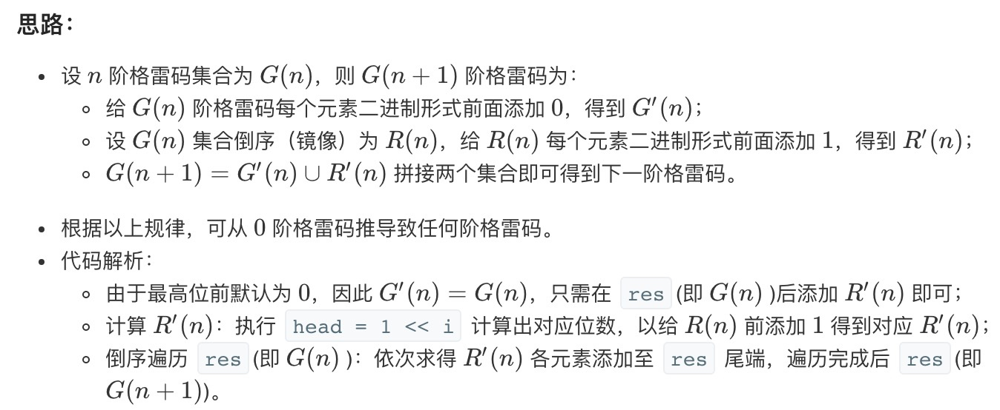

<h1>Leetcode回溯系列（十一）--- 格雷编码</h1>

题目：<https://leetcode-cn.com/problems/gray-code/>

<h2>1. 题目知识点</h2>

1. 位运算：二进制与十进制关系
2. 通原里的**镜像反射法**：




<h2>3. 题目解法</h2>

<h3>3.1 镜像法+位运算</h3>


```
class Solution:
    def grayCode(self, n: int) -> List[int]:
        res, head = [0], 1
        for i in range(n):
            for j in range(len(res)-1, -1, -1):
                res.append(head + res[j])
            head <<= 1
        return res
```


